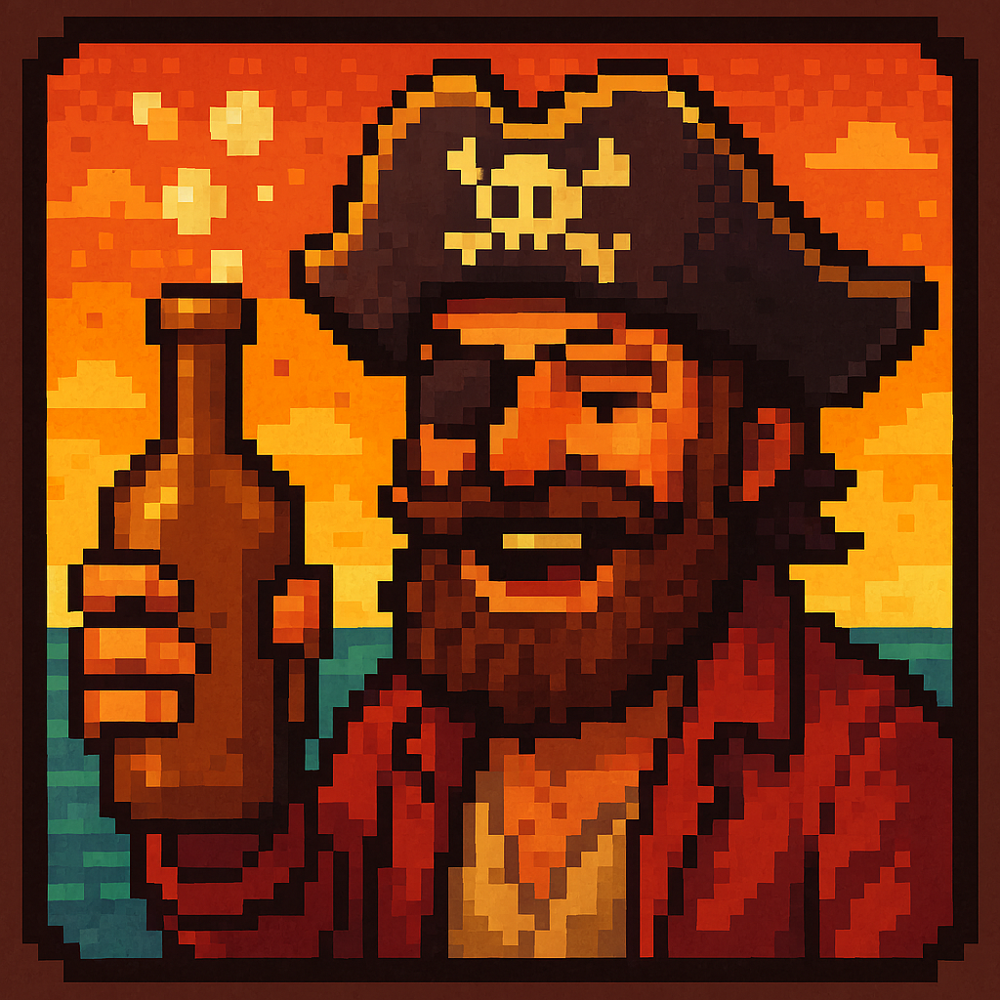

# Drinky Way 🍻🏴‍☠️

A 2D indie RPG about the outrageous adventures of a drunken pirate. Explore taverns, delve into monster-filled dungeons, brawl, gamble, and make choices that shape your legend.

<p align="center">
  
</p>

<p align="center">
  <a href="https://github.com/BolohanAndrei/Drinky-Way/stargazers"></a>
  <a href="https://github.com/BolohanAndrei/Drinky-Way/releases"></a>
  <a href="https://github.com/BolohanAndrei/Drinky-Way"></a>
  <a href="https://github.com/BolohanAndrei/Drinky-Way/issues"></a>
  
  <a href="LICENSE"></a>
</p>

---

## About

Wake up in a tavern with a hangover and half a map. With a tankard in one hand and a blade in the other, stumble, swagger, and scheme your way through bustling harbors, grimy alleys, and cursed dungeons. Your choices—and your blood alcohol level—change everything.

---

## Key Features

- Tavern Life: Drink, haggle, gamble (In progress), overhear rumors.
- Monster Combats: Face sea-beasts, skeleton crews,orcs,slimes,bats and dungeon horrors with timing and tactics.
- Dungeons & Delving: Puzzle-laced labyrinths, traps, secret rooms, and greedy loot runs.
- Drunkenness System: A dynamic “Buzz Meter” that buffs courage and creativity—but blurs vision and aim.
- Choices That Matter: Branching dialogues and faction reputations shape quests, prices, and endings.
- Mini-Games: Dice, blackjack, slots, darts, arm-wrestling, lockpicking, and more to win coin and clues. (In progress)
- Progression: Perks, passives, equipment, and drinking “talents” that redefine your playstyle. (In progress)
- 2D Pixel Charm: Hand-crafted visuals with a cozy-but-chaotic pirate atmosphere.

---

## Story Tease

You’re a washed-up privateer with a reputation, a tab at every port, and a cursed coin that won’t stop whispering. A legendary treasure surfaces on the lips of drunkards and dockhands. To get it, you’ll need wit, grit, and just the right amount of grog.

---

## Gameplay Pillars

- Explore: Stumble through towns and seedy docks, pick up rumors, and discover hidden alleyways.
- Talk & Choose: Charm, threaten, or tip your way through branching conversations.
- Fight: Skill-based encounters that reward positioning, timing, and resource management.
- Dive Dungeons: Solve environmental puzzles, evade traps, and outsmart monstrous guardians.
- Live the Legend: Unlock perks by how you play—brawler, swashbuckler, gambler, or silver-tongued drunk.

---

## Download & Play (🚀 How to Play)

- Easiest: Grab the latest build from [Releases](https://github.com/BolohanAndrei/Drinky-Way/releases) and run it.
- Cross-Platform: Windows, macOS, Linux (Java 24+)

### Run from Source (Java 24+)

- 1. Make sure you have Java 24 or newer installed.
- 2. Go to the Releases page.
- 3. Download the latest DrinkyWay2D.jar file.
- 4. Run the game OR run the game from your terminal:

  ```bash
    java -jar DrinkyWay2D.jar

  ```

---

## Controls

- Move: WASD / Arrow Keys
- Interact / Talk: E / Enter
- Inventory / Menu: Tab / Esc
- Confirm / Back: Enter / E
- Mini-Games: On-screen prompts
- Melee Attack: LeftClick
- Range Attack: RightClick
- Guard/Parry: Q

---

## Systems at a Glance

- Buzz Meter: Alcohol levels tilt stats—confidence up, accuracy down. Manage your “happy medium.”
- Reputation: Taverns remember. Good tippers get rumors; brawlers get… respect?
- Factions: Smugglers, sailors, scholars, and sea cults. Choose your crowd.
- Loot & Crafting: Scrap, brew, and stitch together gear tailored to your vices.
- Save Anywhere: Jump in for a quick dungeon or a long night at the tavern.

---

## Technical

- Language: Java 17+
- Platform: Desktop (Windows/macOS/Linux)
- Rendering: 2D, sprite-based
- Architecture: Modular packages for scenes, entities, input, UI, and systems
- Tools/Engine: Java2D/OpenGL/Java Swing

Project status: Early development. Expect rough edges and frequent updates.

---

## Roadmap

- [ ] Core story arc and multiple endings
- [ ] Advanced Buzz Meter perks and drawbacks
- [ ] Expanded dungeon biomes and unique bosses
- [ ] More tavern mini-games and heist-style quests
- [ ] Key rebinds and full controller support
- [ ] Accessibility options (text size, color filters, screen shake toggle)
- [ ] Localization
- [ ] Steam/itch.io release

Have ideas? Open a feature request!

---

## Contributing

Contributions are welcome—bug fixes, features, balance ideas, or art/audio polish.

1. Discuss first: Open an issue describing your idea or problem.
2. Fork and branch: Keep PRs focused and small where possible.
3. Show it off: Include screenshots/GIFs for UI or gameplay changes.
4. Style: Match existing code style and add comments/tests when helpful.

- Bugs: [Open an issue](https://github.com/BolohanAndrei/Drinky-Way/issues/new?labels=bug&template=bug_report.md)
- Features: [Request a feature](https://github.com/BolohanAndrei/Drinky-Way/issues/new?labels=enhancement&template=feature_request.md)

---

## FAQ

- What do I need to run it?
  - Java 17 or newer.
- Is there a story or is it sandbox?
  - Sandbox with optional side content and mini-games.
- Is combat turn-based or real-time?
  - Designed to be skill-forward; specifics may evolve during development.
- Will there be mod support?
  - Exploring lightweight modding for assets/data once systems stabilize.

---

## Credits

- Design & Development: [BolohanAndrei](https://github.com/BolohanAndrei)
- Map, assets, sounds and sprites: Map and inspiration from RyiSnow / Comunities assests from Itch.Io / Sprites from spriters-resource.com / Sounds from freesound.org
- Thanks: Early playtesters, feedback givers, and the open-source community

---

## License

(Not yet)

---

<p align="center">
  Made with ☕ and questionable life choices. If you enjoy Drinky Way, please <a href="https://github.com/BolohanAndrei/Drinky-Way/stargazers">⭐ star the repo</a>!
</p>
